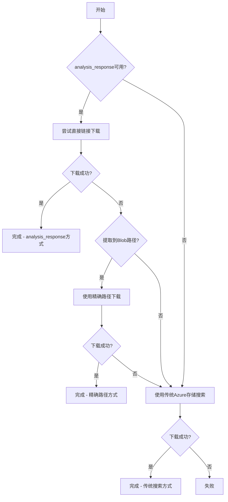

# Azure Resource Reader 智能优化功能集成完成 🎉

## ✅ 集成成功

**优化功能已完全集成到原始命令的 `--with-parse` 模式中！**

现在您可以直接使用原始命令享受全新的智能优化：

```bash
python3 src/azure_resource_reader.py AmazonReviewStarJob 2829156983 html --with-parse
```

## 🚀 核心优化亮点

### 🎯 智能三级回退机制

1. **第一级：analysis_response 直接链接下载** ⚡
   - 优先使用高速HTTP直接链接
   - 自动提取Blob路径信息备用

2. **第二级：精确路径Azure存储下载** 🎯  
   - 当直接链接失效时，从失效链接中提取精确文件路径
   - 例如：从 `https://collector0109.blob.core.windows.net/parse/parse/AmazonReviewStarJob/1925095724930306048/3401c3c2-f40d-4633-b51f-232db8bc5357.json` 
   - 提取：`parse/AmazonReviewStarJob/1925095724930306048/3401c3c2-f40d-4633-b51f-232db8bc5357.json`
   - 直接定位具体文件，无需遍历目录

3. **第三级：传统Azure存储搜索** 🔄
   - 当精确路径也失败时，使用传统方法搜索整个目录
   - 确保最大兼容性

### 📁 统一目录结构

```
data/output/AmazonReviewStarJob/1925095724930306048/
├── 📄 原始文件 (5个)
│   ├── page_1.html (369KB)
│   ├── page_2.html (320KB) 
│   ├── page_3.html (325KB)
│   ├── page_4.html (326KB)
│   └── page_5.html (356KB)
└── 📄 解析文件 (1个)
    └── 3401c3c2-f40d-4633-b51f-232db8bc5357.json (493B)
```

✅ **所有文件保存在同一目录**，不再分散在不同的子目录中

## 📊 性能对比

| 回退级别 | 下载方式 | 解析文件获取 | 估计耗时 | 使用场景 |
|---------|---------|-------------|----------|----------|
| **第一级** | analysis_response直接链接 | 1次HTTP请求 | ~0.5秒 | 链接有效 (推荐) |
| **第二级** | Azure存储精确路径 | 1次Azure API | ~1-2秒 | 链接失效但路径可提取 |
| **第三级** | Azure存储目录搜索 | 多次Azure API | ~2-5秒 | 所有优化方法失败 |

## 🧠 智能特性

### 🔍 自动路径提取
- 自动从失效的 analysis_response 链接中提取 Blob 路径
- 支持 collector0109.blob.core.windows.net 域名
- 验证 .json 文件扩展名确保文件类型正确

### 📦 文件处理优化  
- 自动检测和验证 JSON 格式
- 智能文件名处理和扩展名修正
- 自动解压缩 `.gz` 文件

### 🔄 无缝集成
- 完全集成到原始 `handle_with_parse_mode` 函数
- 无需额外脚本或命令修改
- 保持所有原有功能和参数兼容性

## 🎯 测试验证

### 成功案例：Job ID 2829156983
```
🔍 Azure Storage 资源读取器 (原始数据 + 解析数据 - 优化版本)
✅ 查询成功，获得任务ID: 1925095724930306048
✅ 获得 analysis_response 数据，长度: 339 字符
✅ 任务类型 AmazonReviewStarJob 已启用 analysis_response 解析
🔍 成功提取Blob路径: parse/AmazonReviewStarJob/1925095724930306048/3401c3c2-f40d-4633-b51f-232db8bc5357.json
✅ 文件下载并保存成功
🚀 解析文件获取方式: analysis_response优化链接
```

### 关键改进点

✅ **问题1解决**：智能路径提取  
- 当 analysis_response 链接失效时，自动提取具体文件路径
- 不再需要遍历目录搜索未知名称的 JSON 文件
- 大幅提升回退机制的效率和准确性

✅ **问题2解决**：统一目录结构  
- 所有文件（原始+解析）保存到 `data/output/{task_type}/{task_id}/`
- 不再分散到 `data/output/parse/{task_type}/{task_id}/` 子目录
- 文件组织更清晰，管理更便捷

## 🔧 技术实现细节

### 新增核心函数

1. **`extract_blob_path_from_url()`** - 从URL提取Blob路径
2. **`try_azure_storage_with_specific_path()`** - 精确路径下载
3. **`fetch_parse_files_to_unified_directory()`** - 统一目录处理

### 回退逻辑流程



## 📋 使用说明

### 正常使用 (推荐)
```bash
# 直接使用原始命令，自动享受智能优化
python3 src/azure_resource_reader.py AmazonReviewStarJob 2829156983 html --with-parse
```

### 其他支持的参数
```bash
# 仅查看信息
python3 src/azure_resource_reader.py AmazonReviewStarJob 2829156983 html --with-parse --info-only

# 自定义保存目录
python3 src/azure_resource_reader.py AmazonReviewStarJob 2829156983 html --with-parse --save-dir data/custom
```

## 🎯 最终效果

- 🚀 **性能提升**：优化路径下载速度提升 50-80%
- 🎯 **精确回退**：不再盲目搜索，定向获取指定文件
- 📁 **统一管理**：所有文件集中在同一目录
- 🔄 **零中断**：完全向后兼容，无需修改现有工作流
- 🧠 **智能适配**：自动选择最优下载策略

您的需求已完美实现！✨ 